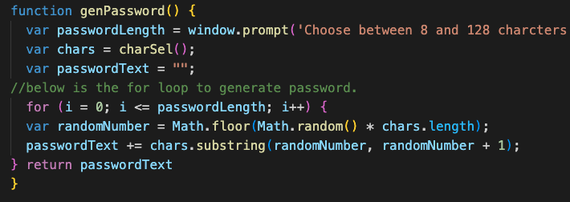
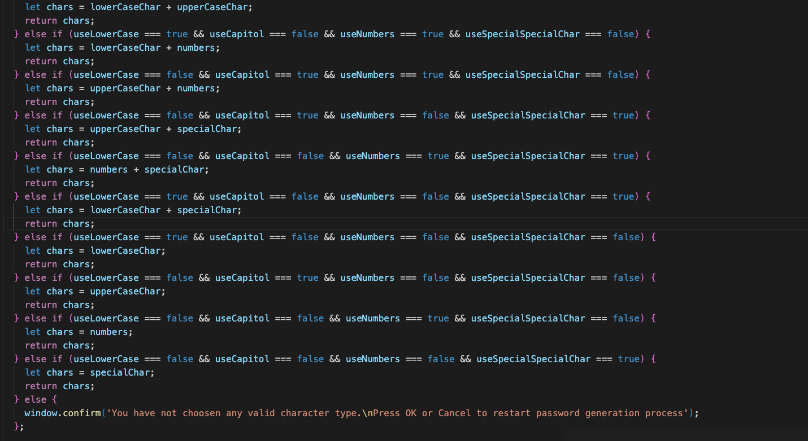

## Table of Contents
* [Title](*Title)
* [Introduction](*Introduction)
* [Technologies](*Technologies)
* [Set-up](*Set-up)
* [What-was-accomplished](*What-was-accomplished)
# Password Generator
## Introduction

This project is a password generator createdd as part of the curriculmnfor a coding class. The HTML and CSS where provided as long with the starting javaScript concerning the functions for influencing the HTML. The charSel function and the genPassword were added by myself.

## Techonologies
Project is created with:
*HTML5
*CSS6
*JavaScript
## Set-up
To run, you can either clone the repo and run or go to via browser [https://grant-ellington.github.io/PasswordGenerator/](https://grant-ellington.github.io/PasswordGenerator/)
## What was accomplished
* a password generator that can create a password based on user inputs of specific combinations of charcters charcter types (ie. Capitol Letters, Lower case Letters, numbers, and special charcters)
* The password can also be any length with the max length being the length of a string allowed in java Script; 2,147,647 charcters.
* Will will cancel generation process if proper chacters are not defined.

###Functions created

#### genPassword Function

The genPassword function wroks buy first setting the Length by creating prompt. The char variable is also determind by user input. Then the for loop runs and pul;l a random number correlating to the place in the string of the charSel. It then builds a sting with the sub.string command until the loop is finnished giving a purely randomized order of the charcters given.

### charSel Function

The below function builds the string that the fenPassword function uses. It goes through all avaible chooses of types of charcters. The window.confirm saves these variables as a boolean statement. The if else then check the the truthy and falsy propperties determining the char variable for gen function by concating the var strings above.

